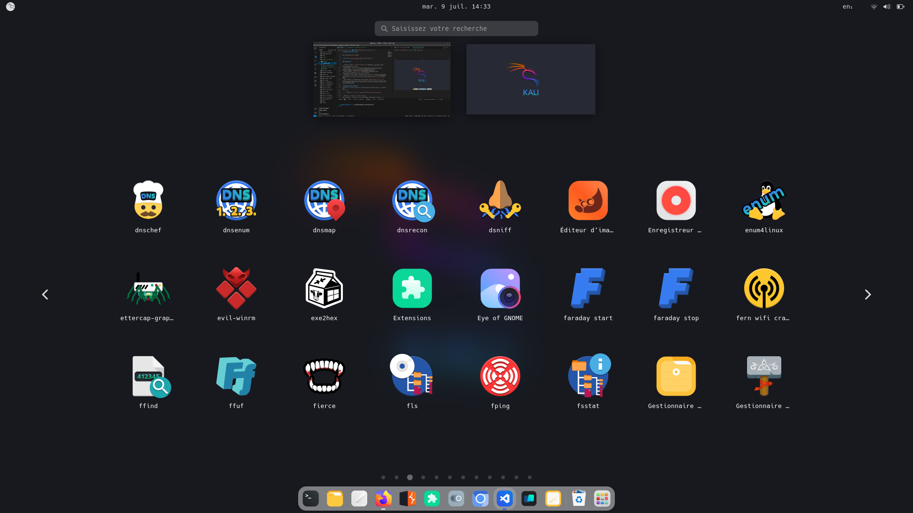

# Gnome Customization

Ma configuration personnalisée pour GNOME. Executez le script apres avoir intaller toutes les dépendances.

## Aperçu

### Bureau


### Menu


## Prérequis

Assurez-vous d'avoir installé les thèmes et polices nécessaires avant de continuer.

- **Cursor Theme**: [Bibata-Modern-Ice](https://github.com/ful1e5/Bibata_Cursor)
- **GTK Theme**: [Orchis](https://github.com/vinceliuice/Orchis-theme/tree/master?tab=readme-ov-file)
- **Icon Theme**: [Reversal-red](https://github.com/yeyushengfan258/Reversal-icon-theme)
- **Document Font Name**: [GoMono Nerd Font 11](https://github.com/ryanoasis/nerd-fonts/releases/download/v3.2.1/Go-Mono.zip)
- **Font Name et Monospace Font Name**: [Hack Nerd Font 11](https://github.com/ryanoasis/nerd-fonts/releases/download/v3.2.1/Hack.zip)

## Installation des extensions GNOME

### Prérequis

Installez le Gestionnaire d'extensions GNOME depuis le dépôt `deb`.

```sh
sudo apt install gnome-shell-extension-manager 
```

Activez l'option User Themes dans le Gestionnaire d'extensions GNOME.
Extensions recommandées

Vous pouvez installer les extensions suivantes via le Gestionnaire d'extensions GNOME ou directement depuis leurs dépôts gitlab ou github.

- **ArcMenu**: [ArcMenu](https://gitlab.com/arcmenu/ArcMenu/-/wikis/Install-From-Source-Guide)
- **Blur my Shell**: [Blur-my-Shell](https://github.com/aunetx/blur-my-shell)
- **Burn my windows**: [Burn-my-windows](https://github.com/Schneegans/Burn-My-Windows)
- **Compiz alike magic lamp effect**: [Compiz-alike-magic-lamp-effect](https://github.com/hermes83/compiz-alike-magic-lamp-effect)
- **Dash to Dock**: [Dash-to-Dock](https://micheleg.github.io/dash-to-dock/)
- **Light Style**: [Light-Style](https://gitlab.gnome.org/GNOME/gnome-shell-extensions)


## Auteur

👤 **Betzalel75**: [Github](https://github.com/Betzalel75)

## Licence

Ce projet est sous licence MIT. Voir le fichier [LICENSE](LICENSE) pour plus de détails.
